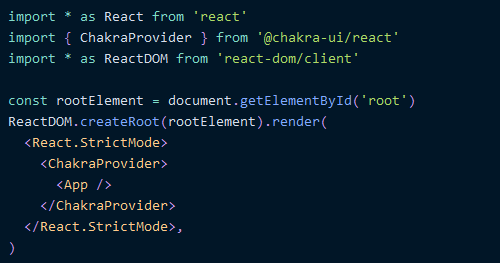
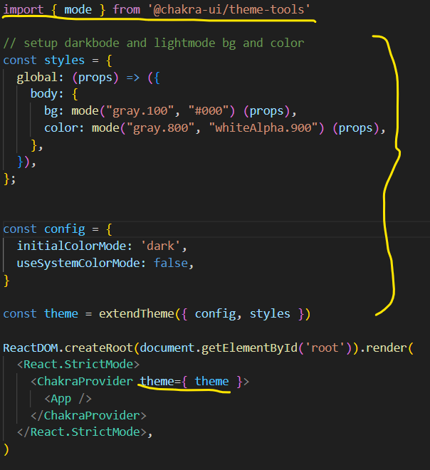

1. Create empty react app -> **npm create vite@latest**

   1. name: .
   2. framework: React
   3. variant: JavaScript
   4. npm install
   5. npm run dev --start app
2. **React && Chakra Setup**

   1. install chakra-ui -> simple modular component library kind of like bootstrap
   2. copy installation script for vite (https://chakra-ui.com/getting-started/vite-guide)
   3. run **npm i @chakra-ui/react @emotion/react @emotion/styled framer-motion** in terminal
   4. Setup ChakraProvider at the root of the app (main.jsx)

      
   5. setup darkbode and lightmode bg and color for the app
   6. packages for icons and navigation -> npm i react-icons react-router-dom
